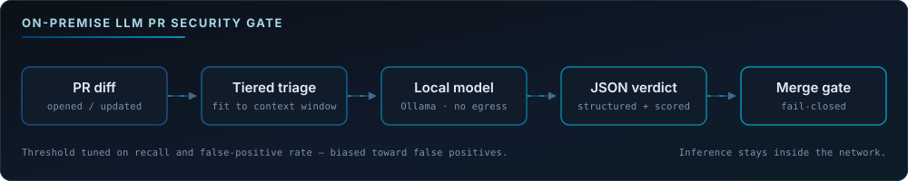

<div align="center">


<a href="https://git.io/typing-svg">
  
</a>

<br/>


<br/>

[](https://www.linkedin.com/in/yee-siang-tey/)
[](mailto:ystey@u.nus.edu)
[](https://github.com/YSTey0808)

<br/>


</div>

---

## About Me

Hi, I am **Yee Siang** — a **Year 3 Computer Science undergraduate at the National University of Singapore**, specialising in **Artificial Intelligence**. I grew up in Malaysia and now study and work in Singapore.

I like building things that people actually use. That has taken me across two software internships, three hackathon teams, and a student organisation of 400+ members — and the pattern I keep coming back to is the same: understand the problem properly, build the smallest thing that solves it, then measure whether it worked. I am equally happy writing the model code, the API behind it, or the interface someone clicks.

Outside of coursework I spend most of my time on **AI systems and full-stack products** — retrieval and RAG pipelines, evaluation, and the infrastructure that makes a model reliable enough to ship. I also served as **President of the NUS Malaysian Students' League**, which taught me as much about working with people as any engineering project has.

Always happy to talk about AI engineering, side projects, or student life in Singapore — my inbox is open.

<div align="center">

| Focus | What that means in practice |
| --- | --- |
| **LLM Systems** | Model harnesses, structured output, prompt/context budgeting, fail-closed design, threshold tuning |
| **Retrieval & RAG** | LangChain pipelines, embeddings, vector search (HNSW / IVF), grounding answers in real sources |
| **DevOps & Security** | GitHub Actions, self-hosted runners, Dependabot automation, on-premise inference, GHES |
| **Full-Stack Product** | React / React Native / TypeScript frontends, Node + Express APIs, PostgreSQL / Supabase / Firebase |

</div>

**Open to — Summer 2027 internships**

<div align="center">


</div>

---

## Tech Stack

<div align="center">

### Languages


<br/>


### AI / ML


<br/>


### Frontend & Backend


<br/>


### Cloud, DevOps & Databases


<br/>


</div>

---

## Experience

### Developer Tech Intern &nbsp;·&nbsp; Singapore Power (SP) Group

**Jun 2026 – Dec 2026 &nbsp;·&nbsp; Singapore**

Extended automated security review across the organisation's enterprise repositories by building an **LLM-powered PR security gate** — a GitHub Action that runs a locally hosted open-source model (Ollama) to flag malicious code intent before merge, keeping **all inference on-premise**.

<div align="center">



</div>

- Engineered the model harness end to end: structured JSON verdicts, fail-closed handling deliberately biased toward false positives, and tiered file prioritisation so large diffs still fit inside the context window.
- Built an automated evaluation suite — mock inference server plus labelled PR test cases — and tuned the decision threshold against **recall and false-positive rate**, choosing security coverage over developer convenience.
- Configured automated Dependabot patching on **GitHub Enterprise Server** with rootless Docker self-hosted runners, gated on test-coverage checks before auto-updates roll out across enterprise repositories.


### Software Developer Intern &nbsp;·&nbsp; TechCircles

**Jan 2024 – May 2024 &nbsp;·&nbsp; Johor Bahru**

- Built a full-stack workflow-approval system (**CakePHP / PHP, MySQL**) that digitised a manual, paper-based approval process for internal operations, cutting approval turnaround time by **50%**.
- Integrated **AirAsia's APIs** and validated / debugged REST endpoints in Postman; wrote integration and API tests across 3 projects to catch defects before release.


---

## Featured Projects

<details open>
<summary><b>Real-Time Harm Detection Platform — Tech4City Hackathon (Huawei Cloud)</b></summary>

<br/>

A platform that flags harmful chat — **grooming, scams, and cyberbullying** — in low-resource **Singlish / Manglish**, where off-the-shelf moderation models fail because the language is code-mixed and under-represented in training data.

| | |
| --- | --- |
| **Stack** | React, TypeScript, Supabase, Vercel Edge Functions, GNN + embedding + LLM hybrid |
| **Role** | Single-handedly owned the full web and hosting stack within a 5-person team; drove end-to-end pipeline testing across model and product |
| **Results** | **89% accuracy** and **100% harmful-actor detection** at a 10% false-positive rate, measured in a 20-user pilot |
| **Why it matters** | The hybrid design exists because no single approach worked: graph structure catches actor patterns, embeddings catch code-mixed phrasing, the LLM catches intent |
| **Timeline** | May 2026 – Aug 2026 |
| **Repository** | <!-- TODO: add repo URL when public --> *link coming* |

</details>

<details>
<summary><b>Geo-Compliance RAG System — TikTok TechJam Hackathon</b></summary>

<br/>

A **RAG compliance engine** that auto-cross-references product features against complex regulatory databases, so a legal review starts from a grounded, cited answer instead of a blank page.

| | |
| --- | --- |
| **Stack** | Python, LangChain, OpenAI embeddings, vector retrieval |
| **Role** | Engineered the retrieval engine within a 4-person team; presented to a panel of technical judges |
| **Results** | Batch-processing pipeline for CSV inputs runs mass compliance checks — roughly **90% less manual legal-review time** |
| **Why it matters** | Compliance is a domain where an unsourced LLM answer is worthless; the value is entirely in the grounding and traceability |
| **Timeline** | Aug 2025 |
| **Repository** | [github.com/YSTey0808/hypedance](https://github.com/YSTey0808/hypedance) |

</details>

<details>
<summary><b>RoamWise — NUS Orbital (Honourable Mention)</b></summary>

<br/>

A real-time **collaborative trip planner** with AI-generated itineraries and live multi-user sync, so a group can plan in one shared document without overwriting each other.

| | |
| --- | --- |
| **Stack** | React, Firebase, JavaScript, real-time sync |
| **Role** | Co-built the application end to end |
| **Results** | **Highest public vote count** at showcase, and an **Honourable Mention** from the judging panel |
| **Why it matters** | The public vote was the useful signal — it validated the user-centric design against real users rather than a rubric |
| **Timeline** | May 2025 – Aug 2025 |
| **Repository** | [github.com/meowzz28/roamwise-orbital](https://github.com/meowzz28/roamwise-orbital) |

</details>

<details>
<summary><b>Care4You — Hack4Good 2026</b></summary>

<br/>

A **React Native elderly-care app** backed by Supabase, built for a hackathon focused on social impact.

| | |
| --- | --- |
| **Stack** | React Native, TypeScript, Supabase |
| **Role** | Contributor on the mobile application |
| **Repository** | [github.com/Hack4Funnn/care4you](https://github.com/Hack4Funnn/care4you) |

</details>

---

## Education & Beyond Code

<table>
<tr>
<td width="55%" valign="top">

### Education


**B.Comp. Computer Science** — *Aug 2024 – May 2028*

> Specialisation in **Artificial Intelligence**
> GPA **4.59 / 5.0**

**Relevant coursework**

Data Structures & Algorithms · Software Engineering · Computer Networks · AI & Machine Learning · Databases · Operating Systems · Probability & Statistics

</td>
<td width="45%" valign="top">

### Leadership & Recognition

**President** — NUS Malaysian Students' League
*Aug 2025 – Jul 2026*

- Led a **40+ member exco** serving **400+** Malaysian students through welfare and cultural-integration programmes
- Liaised with **10+ external partners** including the Malaysian High Commission, securing **SGD 5,000** in sponsorship

**Honourable Mention** — NUS Orbital
*Highest public vote count in cohort*

**Hackathons** — Tech4City (Huawei Cloud) · TikTok TechJam · Hack4Good

</td>
</tr>
</table>

---

## Contribution Snake

<div align="center">

<picture>
  <source media="(prefers-color-scheme: dark)" srcset="https://raw.githubusercontent.com/YSTey0808/YSTey0808/output/github-snake-dark.svg" />
  <source media="(prefers-color-scheme: light)" srcset="https://raw.githubusercontent.com/YSTey0808/YSTey0808/output/github-snake.svg" />
  
</picture>

</div>

---

## Current Focus

```yaml
Building:
  - Taking the LLM PR security gate past POC — hardening it and widening the rollout
  - Evaluation harnesses that measure recall and false-positive rate, not just accuracy
  - Exploring where else LLMs actually pull their weight, and where they do not
  - Full-stack products where the AI is a component, not the whole pitch

Learning:
  - LLM evaluation: grounding, hallucination detection, verdict reliability
  - Agentic workflows — tool use, multi-step reasoning, keeping agents on rails
  - Retrieval quality: hybrid search, chunking strategy, HNSW / IVF trade-offs
  - Model serving and inference under real latency budgets
  - Site reliability engineering: observability, SLOs, incident response, capacity

Interested in:
  - Security engineering where the detector is itself a model
  - Low-resource and code-mixed NLP (Singlish / Manglish)
  - Making AI systems auditable enough for regulated domains
  - Infrastructure that keeps AI services reliable once real users depend on them

Open to (Summer 2027 internships):
  - Software engineering
  - AI / ML engineering
  - LLM and applied AI engineering — RAG, agents, evaluation
  - Site reliability and infrastructure engineering
```

---

## Connect

<div align="center">

[](mailto:ystey@u.nus.edu)
[](https://www.linkedin.com/in/yee-siang-tey/)
[](https://github.com/YSTey0808)

<br/>

<i>"Always building, always learning."</i>


</div>
